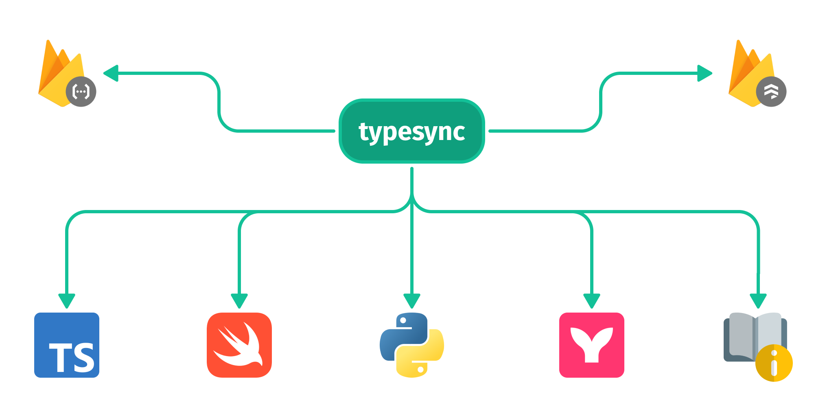

<h1 align="center">
 🪻 typesync
</h1>

    Autogenerate Firestore model types for all platforms

    
    
    
    
    

Typesync is an open-source schema management tool that simplifies managing [Firestore](https://cloud.google.com/firestore) databases. Typesync allows you to maintain a single source of truth for your Firestore architecture in a special _schema_. With this schema in place, you can seamlessly auto-generate type definitions for multiple platforms like TypeScript, Swift, Python, and more using the CLI tool.

Typesync keeps your database and application code consistent and up-to-date at all times. In addition to type definitions, it lets you generate other useful things like Security Rules, Mermaid graphs visualizing your database architecture and documentation for your data models.

[**View the full documentation (docs) ▸**](https://docs.typesync.org)

  

# Documentation

Explore our comprehensive [documentation](https://docs.typesync.org) for detailed guides, usage examples, and additional resources. It covers everything from the basics to more advanced topics:

- [Introduction](https://docs.typesync.org/introduction): Learn what Typesync is and its core features.
- [Installation](https://docs.typesync.org/installation): Instructions on how to install the Typesync CLI.
- [Quickstart](https://docs.typesync.org/quickstart): Get up and running with Typesync quickly.
- [Upgrading](https://docs.typesync.org/upgrading): Guidelines on upgrading to the latest version of the CLI.
- [Types](https://docs.typesync.org/schema/types): Details on the types supported by Typesync’s type system.

# License

This project is made available under the AGPL-3.0 License.
