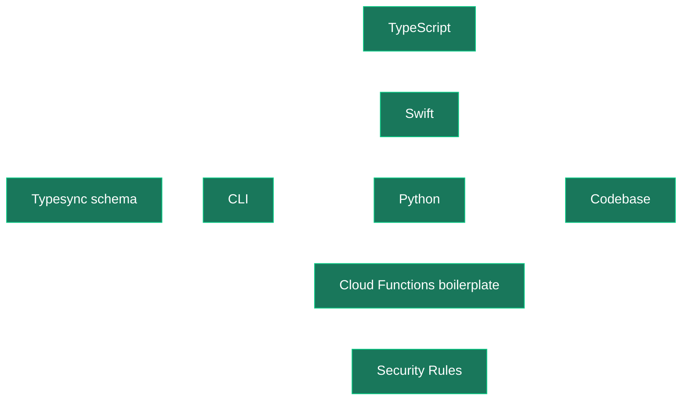

# Typesync

Typesync is an open-source schema management tool for [Firestore](https://cloud.google.com/firestore). It allows you to maintain a single source of truth for your Firestore architecture. With this schema in place, you can effortlessly auto-generate type definitions for multiple platforms like TypeScript, Python, Swift and more using the CLI tool. Typesync also lets you generate other useful things like Firestore Rules, Cloud Functions boilerplate and documentation for your models.

