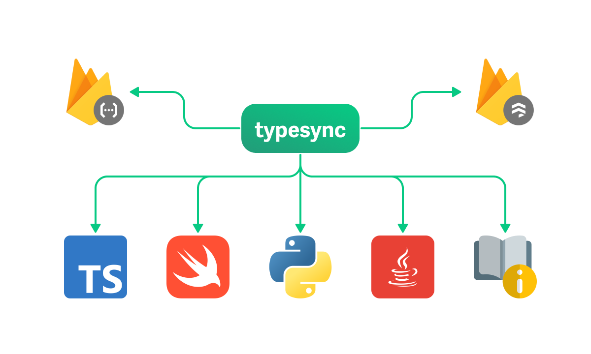

<h1 align="center">
  <a href="https://docs.typesync.org">
    Typesync
  </a>
</h1>

<p align="center">
    Autogenerate Firestore model types for all platforms
</p>

---

<p align="center">
    <a href="https://npmjs.com/package/typesync-cli" alt="Latest version">
        </a>
    <a href="https://app.circleci.com/pipelines/github/kafkas/typesync" alt="Build status">
        </a>
    <a href="https://github.com/kafkas/typesync/pulls" alt="Activity">
        </a>
    <a href="https://github.com/kafkas/typesync">
      </a>
    <a href="https://www.npmjs.com/package/typesync-cli" alt="NPM unpacked size">
        </a>
    <a href="https://github.com/kafkas/typesync/blob/main/LICENSE">
      </a>
</p>

Typesync is an open-source schema management tool for [Firestore](https://cloud.google.com/firestore). It allows you to maintain a single source of truth for your Firestore architecture. With this schema in place, you can effortlessly auto-generate type definitions for multiple platforms like TypeScript, Python, Swift and more using the CLI tool. Typesync also lets you generate other useful things like Security Rules, Cloud Functions boilerplate and documentation for your models.

[**View the full documentation (docs) ▸**](https://docs.typesync.org)

<div align="center">
  
</div>

## Overview

1. [Installation](#installation)
1. [Quickstart](#quickstart)
1. [License](#license)

## Installation

You can install the Typesync CLI either globally or on a per-project basis (locally) depending on your use case. Both options are perfectly valid but, when possible, it's a good idea to install it locally to explicitly tie your project to a specific Typesync CLI version.

**Prerequisite:** The Typesync CLI requires [Node.js](https://nodejs.org) 18 or above to be installed on your machine.

```bash
npm i -g typesync-cli
```

## Quickstart

### Step 1: Install Typesync CLI

First, ensure you have [Node.js](https://nodejs.org) 18+ installed. Then, install the Typesync CLI using npm:

```bash
npm install -g typesync-cli
```

### Step 2: Create your schema

Create a directory within your project to store your Typesync definition files. A common practice is to name this directory `definition`.

```bash
mkdir definition
cd definition
```

Next, create a YAML file named `models.yml` in the `definition` directory. This file will contain the schema definitions for your Firestore documents. Here's a sample schema:

```yaml models.yml
# yaml-language-server: $schema=https://schema.typesync.org/v0.2.json

UserRole:
  model: alias
  docs: Represents a user's role within a project.
  type:
    type: enum
    members:
      - label: Owner
        value: owner
      - label: Admin
        value: admin
      - label: Member
        value: member

User:
  model: document
  docs: Represents a user that belongs to a project.
  type:
    type: object
    fields:
      username:
        type: string
        docs: A string that uniquely identifies the user within a project.
      role:
        type: UserRole
      created_at:
        type: timestamp
```

### Step 3: Generate type definitions

You can now run `typesync generate` to generate the types for the relevant platform. For example, if your project is a Node.js backend that uses Firebase Admin SDK (version 11), run the following command:

```bash
typesync generate --definition 'definition/**/*.yml' --platform ts:firebase-admin:11 --outFile models.ts
```

This command tells Typesync to:

- search for all `.yml` files in the `definition` directory
- generate TypeScript interfaces for use with Firebase Admin SDK (version 11)
- output the generated interfaces to a file named `models.ts`

Here's what the generated TypeScript file might look like:

```ts models.ts
import type { firestore } from 'firebase-admin';

export type Username = string;

/** Represents a user's role within a project. */
export type UserRole = 'owner' | 'admin' | 'member';

/** Represents a user that belongs to a project. */
export interface User {
  /** A string that uniquely identifies the user within a project. */
  username: Username;
  role: UserRole;
  website_url?: string;
  created_at: firestore.Timestamp;
}
```

### Step 4: Integrate into your development workflow

You should regenerate your types anytime the schema changes. To streamline development, consider integrating the Typesync generation command into your build process or CI/CD pipeline.

#### Version Control

Decide if you want to version control the generated files. It can be beneficial for ensuring consistency across environments but may require additional maintenance.

#### Multiple Files

If your project grows, you might want to split your schema into multiple YAML/JSON files. TypeSync will automatically handle all files matching the pattern that you provide to it through the `--definition` option.

# License

This project is made available under the AGPL-3.0 License.
