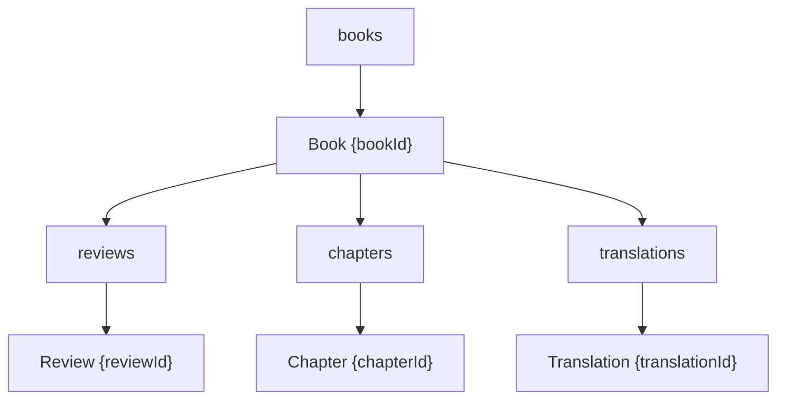

# Graph

```mermaid
graph TB
    books --> generic_bookId["{bookId}"]
    generic_bookId["Book {bookId}"] --> reviews
    generic_bookId["Book {bookId}"] --> chapters
    generic_bookId["Book {bookId}"] --> translations

    %% authors --> generic_authorId["{authorId}"]
    reviews --> generic_reviewId["Review {reviewId}"]
    chapters --> generic_chapterId["Chapter {chapterId}"]
    translations --> generic_translationId["Translation {translationId}"]

    %% classDef collection fill:#f9f,stroke:#333,stroke-width:2px;
    %% class Books,Authors collection;

    %% classDef document fill:#ccf,stroke:#333,stroke-width:1px;
    %% class Book1,Book2,Author1,Author2 document;

    %% classDef subcollection fill:#cfc,stroke:#333,stroke-width:1px;
    %% class Reviews1,Reviews2 subcollection;

    %% classDef review fill:#cff,stroke:#333,stroke-width:1px;
    %% class Review1_1,Review1_2,Review2_1 review;

```
