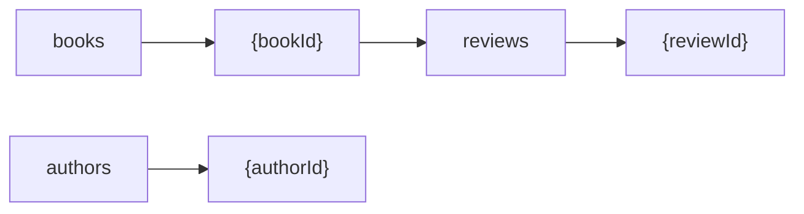

# Architecture

This graph explains how our database is structured.

<!-- typesync-start -->

```mermaid
graph LR
    node1["books"] --> node2["{bookId}"]
    node2["{bookId}"] --> node3["reviews"]
    node3["reviews"] --> node4["{reviewId}"]
    node5["authors"] --> node6["{authorId}"]
```
<!-- typesync-end -->

This graph is automatically generated.
